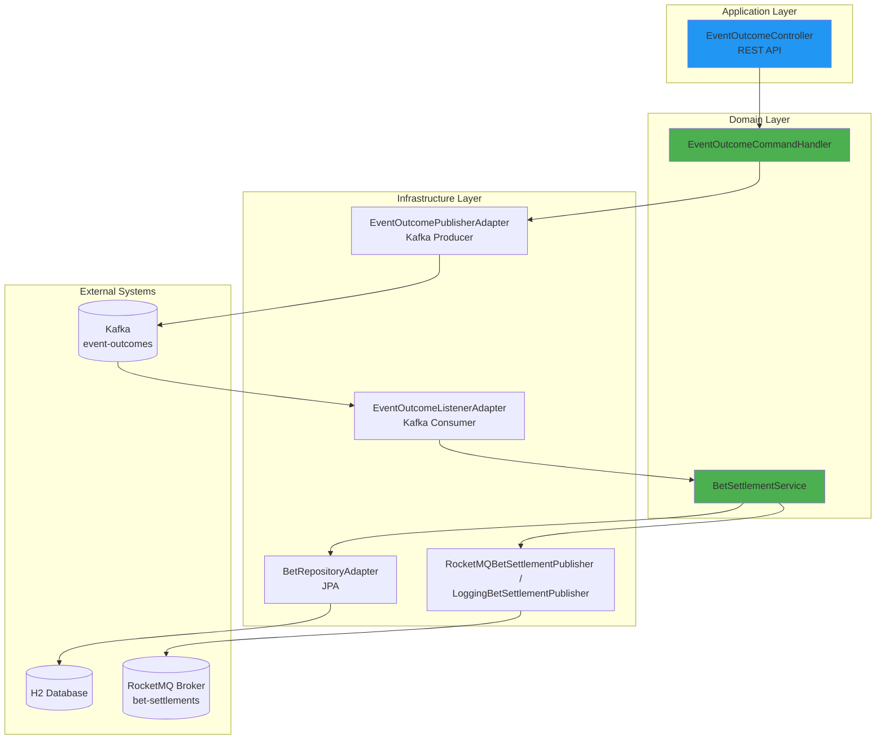
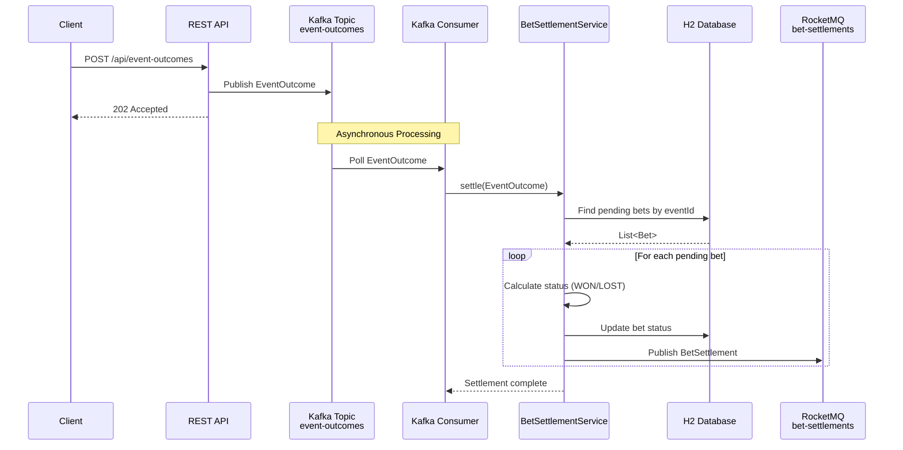
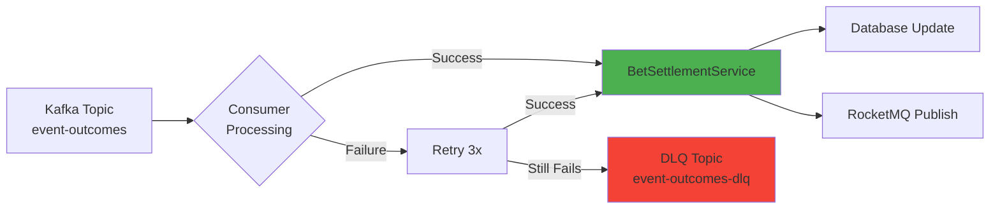
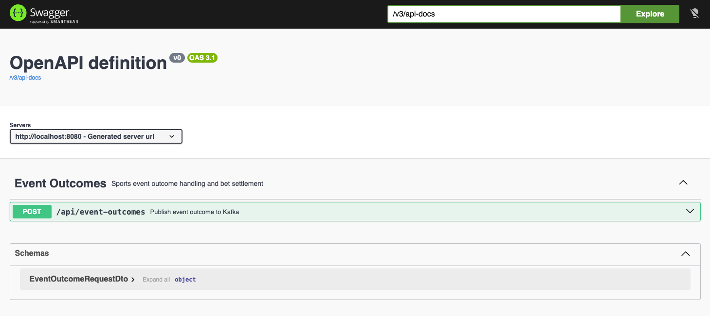
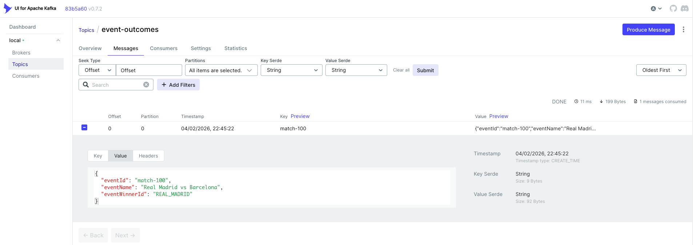
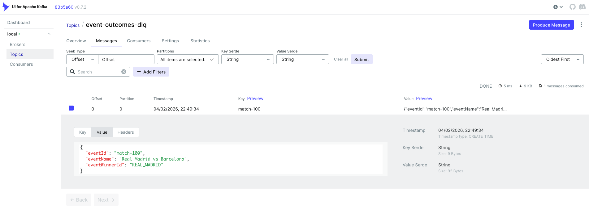
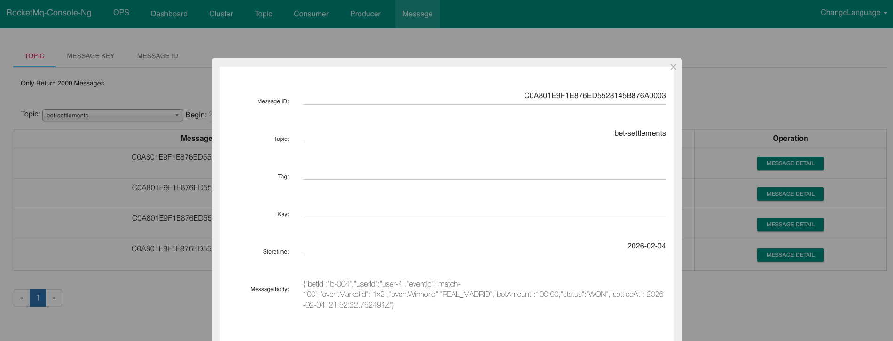
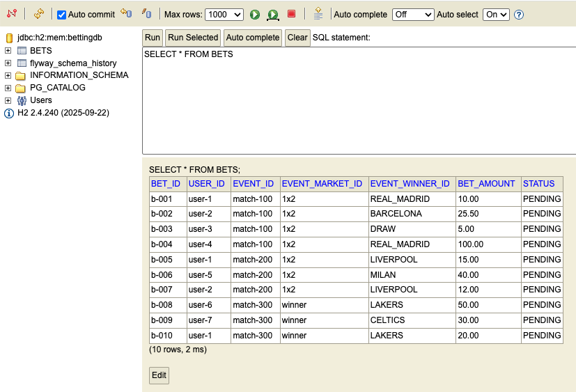

<p align="center">
  
</p>

<h1 align="center">Hexagonal Betting Engine</h1>

> A distributed betting settlement system built with **Spring Boot 4**, **Kafka**, and **RocketMQ** using **Hexagonal Architecture**.

[](https://openjdk.org/)
[](https://spring.io/projects/spring-boot)
[](https://kafka.apache.org/)
[](https://rocketmq.apache.org/)
[](https://www.h2database.com/)

---

## 📋 Table of Contents

- [Overview](#-overview)
- [Architecture](#-architecture)
- [Technology Stack](#-technology-stack)
- [Communication Flow](#-communication-flow)
- [Project Structure](#-project-structure)
- [Getting Started](#-getting-started)
- [API Documentation](#-api-documentation)
- [Testing](#-testing)
- [Monitoring](#-monitoring)
- [Design Decisions](#-design-decisions)

---

## 🎯 Overview

The **Hexagonal Betting Engine** is an event-driven microservice that processes betting settlements in real-time. It consumes event outcomes from Kafka, updates bet statuses in the database, and publishes settlement notifications to RocketMQ.

### Key Features

- ✅ **Event-Driven Architecture** - Kafka for event ingestion, RocketMQ for settlement notifications
- ✅ **Hexagonal Architecture** - Clean separation between domain, application, and infrastructure layers
- ✅ **Transactional Consistency** - ACID guarantees with Spring `@Transactional`
- ✅ **Error Handling** - Dead Letter Queue (DLQ) for failed messages
- ✅ **Comprehensive Testing** - Unit tests, integration tests, and E2E tests
- ✅ **In-Memory Database** - H2 for development and testing
- ✅ **OpenAPI Documentation** - Swagger UI for API exploration

---

## 🏛️ Architecture

This project implements **Hexagonal Architecture** (Ports & Adapters) to achieve high testability, maintainability, and independence from external frameworks.



### Architectural Layers

| Layer | Responsibility | Examples |
|-------|---------------|----------|
| **Domain** | Core business logic, entities, ports | `Bet`, `BetSettlementService`, `BetRepository` |
| **Application** | Use cases, DTOs, exception handling | `EventOutcomeController`, `GlobalExceptionHandler` |
| **Infrastructure** | External integrations, adapters | Kafka, RocketMQ, JPA, H2 |

---

## 💻 Technology Stack

| Category | Technology | Version |
|----------|-----------|---------|
| **Language** | Java | 21 |
| **Framework** | Spring Boot | 4.0.2 |
| **Messaging** | Kafka Client | 4.1.1 |
| **Messaging** | RocketMQ Client | 5.3.2 |
| **Database** | H2 (In-Memory) | Latest |
| **Migration** | Flyway | Latest |
| **Build Tool** | Gradle | 9.3 |
| **Testing** | JUnit 5, Mockito, AssertJ | Latest |
| **Documentation** | SpringDoc OpenAPI | 3.0.1 |
| **Docker** | Kafka (Confluent) | 7.7.7 |
| **Docker** | RocketMQ | 4.9.7 |

---

## 🔄 Communication Flow

### End-to-End Settlement Flow



### Kafka Error Handling with DLQ



---

## 📁 Project Structure

```
src/
├── main/
│   ├── java/com/mario/hexagonalbettingengine/
│   │   ├── HexagonalBettingEngineApplication.java  # Main Spring Boot application
│   │   │
│   │   ├── domain/                      # 🟢 Domain Layer (Core Business Logic)
│   │   │   ├── betting/
│   │   │   │   ├── Bet.java            # Domain entity
│   │   │   │   ├── BetStatus.java      # Domain enum
│   │   │   │   ├── BetRepository.java  # Port (interface)
│   │   │   │   ├── BetSettlement.java  # Port (interface)
│   │   │   │   ├── BetSettlementService.java  # Domain service
│   │   │   │   └── BetSettlementPublisher.java # Port (interface)
│   │   │   └── eventoutcome/
│   │   │       ├── EventOutcome.java   # Domain entity
│   │   │       ├── EventOutcomeCommandHandler.java
│   │   │       └── EventOutcomePublisher.java  # Port (interface)
│   │   │
│   │   ├── application/                 # 🔵 Application Layer (Use Cases)
│   │   │   ├── eventoutcome/
│   │   │   │   ├── EventOutcomeController.java
│   │   │   │   ├── request/
│   │   │   │   │   └── EventOutcomeRequestDto.java
│   │   │   │   └── mapper/
│   │   │   │       └── EventOutcomeDtoMapper.java
│   │   │   └── GlobalExceptionHandler.java
│   │   │
│   │   └── infrastructure/              # 🟠 Infrastructure Layer (Adapters)
│   │       ├── betting/
│   │       │   ├── BetEntity.java       # JPA entity
│   │       │   ├── BetStatus.java       # Infrastructure enum
│   │       │   ├── BetJpaRepository.java
│   │       │   ├── BetRepositoryAdapter.java
│   │       │   ├── RocketMQBetSettlementPublisher.java
│   │       │   ├── LoggingBetSettlementPublisher.java
│   │       │   ├── mapper/
│   │       │   │   └── BetMapper.java
│   │       │   └── payload/
│   │       │       ├── BetPayload.java
│   │       │       └── BetStatus.java
│   │       ├── eventoutcome/
│   │       │   ├── EventOutcomeListenerAdapter.java  # Kafka consumer
│   │       │   ├── EventOutcomePublisherAdapter.java # Kafka producer
│   │       │   ├── mapper/
│   │       │   │   └── EventOutcomeMapper.java
│   │       │   └── payload/
│   │       │       └── EventOutcomePayload.java
│   │       └── config/
│   │           ├── JacksonConfig.java
│   │           ├── KafkaConfig.java
│   │           ├── KafkaTopicConfig.java
│   │           └── MessagingProperties.java
│   │
│   └── resources/
│       ├── application.yml
│       └── db/migration/
│           ├── V1__create_bets_table.sql
│           └── V2__seed_initial_bets.sql
│
└── test/
    ├── java/com/mario/hexagonalbettingengine/
    │   ├── BaseIT.java                  # Base integration test class
    │   ├── BetSettlementEndToEndIT.java # E2E test
    │   │
    │   ├── domain/                      # 🟢 Domain unit tests
    │   │   ├── betting/
    │   │   │   ├── BetTest.java
    │   │   │   └── BetSettlementServiceTest.java
    │   │   └── eventoutcome/
    │   │       └── EventOutcomeCommandHandlerTest.java
    │   │
    │   ├── application/                 # 🔵 Application unit/integration tests
    │   │   └── eventoutcome/
    │   │       ├── EventOutcomeControllerIT.java
    │   │       ├── EventOutcomeControllerTest.java
    │   │       └── mapper/
    │   │           └── EventOutcomeDtoMapperTest.java
    │   │
    │   ├── infrastructure/              # 🟠 Infrastructure unit/integration tests
    │   │   ├── betting/
    │   │   │   ├── BetRepositoryAdapterIT.java
    │   │   │   ├── BetRepositoryAdapterTest.java
    │   │   │   ├── LoggingBetSettlementPublisherTest.java
    │   │   │   ├── RocketMQBetSettlementPublisherTest.java
    │   │   │   └── mapper/
    │   │   │       └── BetMapperTest.java
    │   │   └── eventoutcome/
    │   │       ├── EventOutcomeKafkaConsumerIT.java
    │   │       ├── EventOutcomeKafkaProducerIT.java
    │   │       ├── EventOutcomeListenerAdapterTest.java
    │   │       ├── EventOutcomePublisherAdapterTest.java
    │   │       └── mapper/
    │   │           └── EventOutcomeMapperTest.java
    │   │
    │   └── fixtures/                    # Test data builders
    │       ├── BetEntityFixtures.java
    │       ├── BetFixtures.java
    │       ├── EventOutcomeFixtures.java
    │       └── EventOutcomeRequestDtoFixtures.java
    │
    └── resources/
        └── application-test.yml
```

---

## 🚀 Getting Started

### Prerequisites

- **Docker & Docker Compose** 🐳
- **Java 21** (for local development)
- **Gradle 9+** (optional, wrapper included)

### Clone the Repository

```bash
git clone https://github.com/MarioCroSite/hexagonal-betting-engine.git
cd hexagonal-betting-engine
```

---

### ⚡ Option 1: Local Development (Recommended)

**Best for:** Daily development, debugging, and rapid iteration with hot reload.

#### 1️⃣ Start Infrastructure Services

Start Kafka, RocketMQ, and their monitoring UIs using Docker Compose:

```bash
docker-compose up -d
```

This will start:
- **Kafka** on `localhost:9092`
- **Kafka UI** on `http://localhost:8090`
- **RocketMQ NameServer** on `localhost:9876`
- **RocketMQ Broker** on `localhost:10911`
- **RocketMQ Dashboard** on `http://localhost:8082`

#### 2️⃣ Run Application Locally

```bash
./gradlew bootRun
```

- Application starts on `http://localhost:8080`
- H2 Console available at `http://localhost:8080/h2-console`
- Swagger UI available at `http://localhost:8080/swagger-ui/index.html`
- Changes reload automatically with Spring DevTools

---

### 🐳 Option 2: Full Docker Stack (Advanced)

**Best for:** Production-like environment, E2E testing, CI/CD pipelines, and demonstrations.

#### 1️⃣ Build Application Docker Image

```bash
docker build -t hexagonal-betting-engine:latest .
```

**Image Details:**
- Multi-stage build (Eclipse Temurin 21 → Amazon Corretto 21)
- Optimized layer caching for dependencies
- Alpine-based for minimal footprint
- JVM tuned for containerized environments

#### 2️⃣ Start Full Stack

```bash
docker-compose --profile full-stack up -d
```

This will start **all services** including the application container.

#### 3️⃣ View Application Logs

```bash
docker logs -f betting_app
```

- Application containerized and running on `http://localhost:8080`
- All services isolated in Docker network `betting-net`
- Production-ready setup with container health checks

---

## ⚙️ Configuration

### RocketMQ Operating Modes

The system supports two different modes for publishing bet settlements using **Conditional Bean Registration** (`@ConditionalOnProperty`), allowing you to toggle between logging-only mode and real RocketMQ connectivity.

#### Toggle Switch

In `application.yml`, control whether the application communicates with a real RocketMQ broker:

```yaml
app:
  messaging:
    rocketmq:
      enabled: false # false = Logging only, true = Real RocketMQ
```

| `enabled` | Active Implementation | Behavior |
|-----------|----------------------|----------|
| `false` | `LoggingBetSettlementPublisher` | Settlements are printed to console/logs. Best for rapid development without Docker stack. |
| `true` | `RocketMQBetSettlementPublisher` | Messages sent to live RocketMQ broker. Required for full end-to-end testing. |

### RocketMQ Networking Setup

⚠️ **Important:** RocketMQ requires specific networking setup to bridge Docker containers and your host machine.

**Version Choice:**
- Uses RocketMQ **4.9.7** for maximum stability and compatibility with Dashboard
- Avoids the complexity of gRPC Proxy introduced in version 5.x

**The `brokerIP1` Requirement:**
- The RocketMQ broker must broadcast an IP address reachable by your application
- Configured in `rocketmq/broker.conf` file
- **Recommendation:** Use your actual LAN IP (e.g., `192.168.x.x`) or `host.docker.internal`
- This ensures the application on your host can "handshake" with the broker inside Docker

**Troubleshooting:**
- If you encounter connection timeouts, verify that your machine's IP matches the one in `broker.conf`
- Check Docker network configuration: `docker network inspect betting-net`

---

## 📚 API Documentation

### Swagger UI

Access the interactive API documentation at:

```
http://localhost:8080/swagger-ui/index.html
```



### Core Endpoint

#### 🎲 Publish Event Outcome

Publishes an event outcome to Kafka, triggering bet settlement for all pending bets on that event.

```bash
curl -X POST http://localhost:8080/api/event-outcomes \
  -H "Content-Type: application/json" \
  -d '{
    "eventId": "match-100",
    "eventName": "Real Madrid vs Barcelona",
    "eventWinnerId": "REAL_MADRID"
  }'
```

**Response:**
```
HTTP/1.1 202 Accepted
```

### 🧪 Run Test Scenarios

The application comes with **pre-seeded pending bets** via Flyway migration (`V2__seed_initial_bets.sql`). Below are three realistic test scenarios to demonstrate the end-to-end bet settlement flow:

---

#### Scenario 1: El Clásico ⚽

**Context:** Spain's biggest football rivalry - Real Madrid vs Barcelona

**Seeded Bets:**
| Bet ID | User | Predicted Winner | Amount | Status |
|--------|------|------------------|--------|--------|
| `b-001` | user-1 | REAL_MADRID | €10.00 | PENDING |
| `b-002` | user-2 | BARCELONA | €25.50 | PENDING |
| `b-003` | user-3 | DRAW | €5.00 | PENDING |
| `b-004` | user-4 | REAL_MADRID | €100.00 | PENDING |

**Trigger Event Outcome:**
```bash
curl -X POST http://localhost:8080/api/event-outcomes \
  -H "Content-Type: application/json" \
  -d '{
    "eventId": "match-100",
    "eventName": "Real Madrid vs Barcelona",
    "eventWinnerId": "REAL_MADRID"
  }'
```

**Expected Result:**
- ✅ **2 WON:** `b-001`, `b-004` (predicted REAL_MADRID correctly)
- ❌ **2 LOST:** `b-002`, `b-003` (predicted BARCELONA and DRAW)
- 📤 4 settlement messages published to RocketMQ

---

#### Scenario 2: Champions League Thriller 🏆

**Context:** European club football's elite competition - Liverpool vs AC Milan

**Seeded Bets:**
| Bet ID | User | Predicted Winner | Amount | Status |
|--------|------|------------------|--------|--------|
| `b-005` | user-1 | LIVERPOOL | €15.00 | PENDING |
| `b-006` | user-5 | MILAN | €40.00 | PENDING |
| `b-007` | user-2 | LIVERPOOL | €12.00 | PENDING |

**Trigger Event Outcome:**
```bash
curl -X POST http://localhost:8080/api/event-outcomes \
  -H "Content-Type: application/json" \
  -d '{
    "eventId": "match-200",
    "eventName": "Liverpool vs Milan",
    "eventWinnerId": "MILAN"
  }'
```

**Expected Result:**
- ✅ **1 WON:** `b-006` (predicted MILAN correctly)
- ❌ **2 LOST:** `b-005`, `b-007` (predicted LIVERPOOL)
- 📤 3 settlement messages published to RocketMQ

---

#### Scenario 3: NBA Showdown 🏀

**Context:** Historic basketball rivalry - Los Angeles Lakers vs Boston Celtics

**Seeded Bets:**
| Bet ID | User | Predicted Winner | Amount | Status |
|--------|------|------------------|--------|--------|
| `b-008` | user-6 | LAKERS | $50.00 | PENDING |
| `b-009` | user-7 | CELTICS | $30.00 | PENDING |
| `b-010` | user-1 | LAKERS | $20.00 | PENDING |

**Trigger Event Outcome:**
```bash
curl -X POST http://localhost:8080/api/event-outcomes \
  -H "Content-Type: application/json" \
  -d '{
    "eventId": "match-300",
    "eventName": "Lakers vs Celtics",
    "eventWinnerId": "LAKERS"
  }'
```

**Expected Result:**
- ✅ **2 WON:** `b-008`, `b-010` (predicted LAKERS correctly)
- ❌ **1 LOST:** `b-009` (predicted CELTICS)
- 📤 3 settlement messages published to RocketMQ

---

> **💡 Tip:** After triggering any scenario, verify settlements in:
> - **H2 Console** (`http://localhost:8080/h2-console`) - Query: `SELECT * FROM bets WHERE event_id = 'match-100';`
> - **RocketMQ Dashboard** (`http://localhost:8082`) - Check `bet-settlements` topic messages
> - **Application Logs** - Watch for settlement processing confirmations

---

## 🧪 Testing

### Test Coverage

The project has **comprehensive test coverage** across all architectural layers:

| Test Type | Coverage |
|-----------|----------|
| **Unit Tests** | Domain & Application layers |
| **Integration Tests** | Kafka, RocketMQ, Database |
| **E2E Tests** | Full flow: Kafka → DB → RocketMQ |

### Running Tests

#### Run All Tests

```bash
./gradlew test
```

#### Run Only Unit Tests

```bash
./gradlew test --tests "*Test"
```

#### Run Only Integration Tests

```bash
./gradlew test --tests "*IT"
```

### Test Report

After running tests, view the HTML report:

```bash
open build/reports/tests/test/index.html
```

---

## 📊 Monitoring

### Kafka UI

Monitor Kafka topics, consumer groups, and messages:

```
http://localhost:8090
```

**Navigation:**
1. Go to **Topics** → `event-outcomes`
2. Click **Messages** to see consumed events
3. Check **Consumer Groups** for processing status

#### Event Outcomes Topic



#### Dead Letter Queue (DLQ)



### RocketMQ Dashboard

Monitor RocketMQ topics and message flows:

```
http://localhost:8082
```



**Features:**
- View topic statistics
- Monitor message traces
- Check consumer status

### H2 Database Console

Access the H2 in-memory database console for development and debugging:

```
http://localhost:8080/h2-console
```



**Connection details:**
- JDBC URL: `jdbc:h2:mem:betting-db`
- Username: `sa`
- Password: _(leave empty)_

---

## 🎨 Design Decisions

### 1. **Hexagonal Architecture (Ports & Adapters)**

**Why:** Achieve independence from frameworks and external systems.

- **Domain Layer** contains pure business logic with no external dependencies
- **Ports** (interfaces) define contracts between layers
- **Adapters** (implementations) handle external integrations (Kafka, RocketMQ, JPA)

**Benefits:**
- ✅ Testability: Domain logic can be tested without infrastructure
- ✅ Flexibility: Easy to swap adapters (e.g., replace Kafka with RabbitMQ)
- ✅ Maintainability: Clear separation of concerns

### 2. **Event-Driven Architecture**

**Why:** Decouple event ingestion from settlement processing.

- REST API publishes events to Kafka (non-blocking)
- Kafka consumer processes events asynchronously
- RocketMQ publishes settlement notifications to downstream systems

**Benefits:**
- ✅ Scalability: Consumers can scale independently
- ✅ Resilience: Failed messages go to DLQ for manual review
- ✅ Performance: Non-blocking API responses

### 3. **Domain-Driven Design (DDD)**

**Why:** Model complex business rules explicitly.

- `Bet` aggregate encapsulates bet validation and status transitions
- `BetSettlementService` orchestrates settlement logic
- Domain events could be added for audit trails (future enhancement)

### 4. **Transactional Outbox Pattern** (Implicit)

**Why:** Ensure consistency between database updates and message publishing.

- Settlement updates and RocketMQ publishing happen within a single `@Transactional` boundary
- If RocketMQ fails, database transaction rolls back

### 5. **Configuration-Driven Design**

**Why:** Externalize configuration for different environments.

```yaml
app:
  messaging:
    rocketmq:
      enabled: true
      topic: bet-settlements
    kafka:
      event-outcomes:
        topic: event-outcomes
        dlq-topic: event-outcomes-dlq
        retry-attempts: 3
```

### 6. **Dead Letter Queue (DLQ) Pattern**

**Why:** Handle poison messages without blocking the consumer.

- Failed messages are retried 3 times with exponential backoff
- After 3 failures, message is sent to `event-outcomes-dlq`
- DLQ messages can be manually reviewed and reprocessed

### 7. **Type-Safe Configuration with Records**

**Why:** Immutable, compile-time-safe configuration.

```java
@ConfigurationProperties(prefix = "app.messaging")
public record MessagingProperties(
    RocketMqConfig rocketmq,
    KafkaConfig kafka
) { }
```

---

## 🚀 Future Improvements

This assignment focuses on the **Event Outcome Settlement** flow, demonstrating how bets are automatically settled when sports events conclude. To fully support a production betting platform, the following enhancements are planned:

### 1. **Bet Management API**

Currently, bets are pre-seeded via Flyway migrations for demonstration purposes. A production system would require:

#### `POST /api/bets` - Place a Bet

**Request:**
```json
{
  "userId": "user-123",
  "eventId": "match-500",
  "eventMarketId": "1x2",
  "eventWinnerId": "REAL_MADRID",
  "betAmount": 50.00
}
```

**Response:**
```json
{
  "betId": "b-101",
  "status": "PENDING",
  "placedAt": "2026-02-05T14:30:00Z"
}
```

**Domain Considerations:**
- **Validation:** Ensure event exists, market is open, bet amount meets minimum requirements
- **Idempotency:** Prevent duplicate bets using idempotency keys
- **Balance Check:** Integrate with wallet service to verify user funds

---